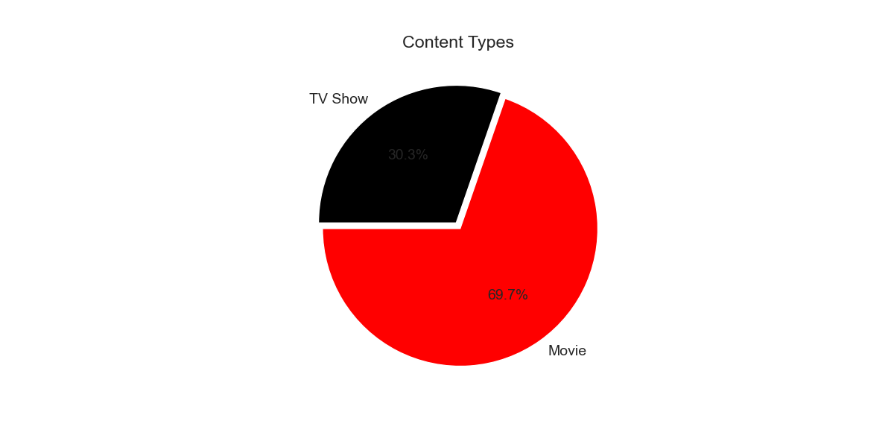
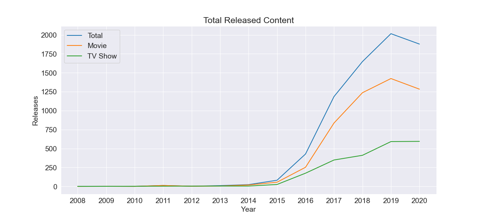
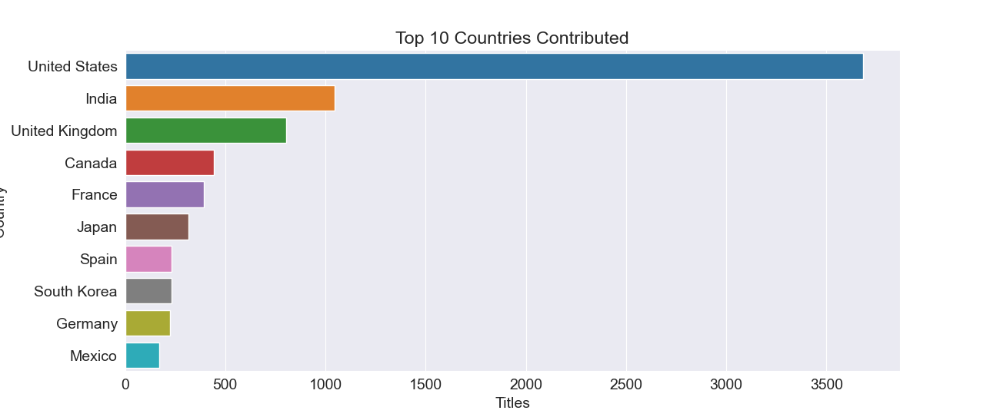

# NetflixData

In this project, I looked at Netflix and performed data analysis on their content. This project was designed to look at the content and usage of Netlflix over time and in different countries.The data set I used to analyze was [Netflix Titles](https://www.kaggle.com/shivamb/netflix-shows) from Kaggle. 

The main focus for the writing this software was to learn more about data analysis exploration and visualization. 

# Data Analysis Results

1. What is the percentage of available entertainment provided by Netflix? 
In the results, I found that the majority of available content was Movies by 69.7% and the rest was TV Shows by 30.3%.

2. How has the total content released changed over time?
Looking at results gathered from the dataset the content initially was low but grew rapidly in the past five years. (The dataset was gathered from 2020, so results in 2020 aren't the full year content)

3. What are the top countries that produce content released onto Netflix?
We can identify that the USA creates the highest amount of content released onto Netflix with over 3500 titles.  

# Development Environment

Visual Studio Code
Python
Pandas
Matplotlib
Datasets

# Useful Websites

* [Medium Tutorial](https://medium.com/analytics-vidhya/netflix-movies-and-tvshows-exploratory-data-analysis-eda-and-visualization-using-python-80753fcfcf7)
* [Pandas Docs](https://pandas.pydata.org/docs/index.html)
* [Jovian Tutorial](https://jovian.ai/astha1998/netflix-data-analysis-project)

# Future Work

* Update functions
* Add more exploratory analysis and visualization